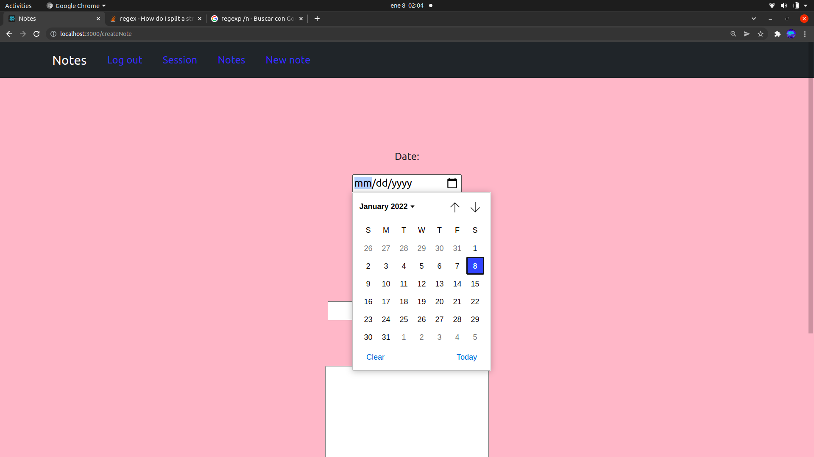

# Notes

Si quieres utilizar la aplicación puedes acceder en esta url: https://amdevnotes.herokuapp.com/

## Descripción del proyecto

Esta aplicación consiste en un block en el que el usuario puede crear, consultar, acutualizar y eliminar notas.
Las notas están compuestas por un título, el contenido de la nota propiamente dicha y la fecha y hora de la tarea.

## ¿Cómo se utiliza la aplicación?

### Sign up

El primer paso para poder utilizar la aplicación será registrarse con un usuario y contraseña. Los campos del formulario deberán estar correctamente rellenos y la contraseña debe tener una logitud mínima de ocho caracteres.

### Log in

Para poder entrar deberemos introducir un usuario registrado con su correspondiente contraseña. En caso de que usuario y contraseña sean correctos, recibiremos un token de autenticación y accederemos a la sesión de manera automática. En caso contrario, se nos mostrará de nuevo el formulario de login pero esta vez con un mensaje de error.

### Inicio de sesión

Esta página nos muestra un mensaje de bienvenida personalizado con el nombre del usuario que se encuentra logueado.

### Crear nota

Se trata de un formulario que debemos rellenar para crear una nota nueva introduciendo la fecha y la hora de realización de la tarea, el título de la misma y la descripción.

Tanto en este formulario como en el de actualizar nota, la utilización del type date para la fecha y el type time para la hora nos facilitan enormemente la labor como desarrolladores y posibilitan el dar una mejor experiencia de usuario de manera sencilla.

### Ver todas las notas del usuario

Esta página nos muestra un listado con todas las notas que ha registrado el usuario ordenadas por fecha.

### Detalle de una nota

Si hacemos click sobre una nota de la lista podemos acceder al detalle en el que se nos mostrará toda la información y los enlacer para modificar la nota y borrar la nota.

### Actualizar nota

Este formulario es igual que el de creación, con la únida salvedad de que, en este componente, los campos viene rellenos de primeras con la información actual para que nosotros la modifiquemos.

### Borrar nota

Si en el detalle de la nota seleccionamos la opción delete se nos mostrará una pantalla de confirmación en la cual se nos preguntará si queremos borrar la nota definivamente o si queremos volver a la página del detalle.

### Logout

En la barra de navegación también encontramos la opción de log out o cierre de sesión. Si hacemos click en ella seremos redirigidos a la página inicial de la aplicación, nuestro token de autenticación será borrado y tendremos que volver a loguearnos para entrar de nuevo a nuestra sesión.

## Tecnologías utilizadas

### `React`

React es una biblioteca de Javascript que sirve para crear interfaces de usuario de una manera sencilla y basándonos en la elaboración de componentes.

### `ReactDOM`

React Dom es el conjunto de bibliotecas de React que nos permiten emplear funcionalidades implementadas específicamente para aplicaciones web.

### `React Router DOM`

Se trata de un conjunto de funcionalidades que nos permiten linkear y enrutar todo nuestro proyecto.
En este proyecto he empleado la versión 6 de este paquete de software.

### `React Scripts`

Nos permite arrancar scripts de manera directa.

### `Bootstrap`

Bootstrap es un framework front-end utilizado para desarrollar aplicaciones web y sitios mobile first, es decir, con un layout que se adapta a la pantalla del dispositivo utilizado por el usuario.

### `React Bootstrap`

React Bootstrap es un conjunto de librerías de Bootstrap diseñadas específicamente para ser utilizadas dentro de un proyecto de React.

### `Axios`

Axios es una librería que a modo de cliente nos permite hacer peticiones HTTP a un servidor.
En este caso, las llamadas las estamos haciendo a una API REST ubicada creada de propio para este proyecto y que se encuentra en el dominio https://amdevnotesapi.herokuapp.com.

## Puesta en marcha

Para arrancar este proyecto de manera local los pasos a seguir son los siguientes:

### `Descargar el repositorio`

Clonaremos el repositorio en nuestro equipo utilizando el comando "git clone" seguido de la url del repositorio.

### `Instalar los paquetes de software`

Una vez clonado el proyecto, accederemos a la raíz del mismo mediante nuestra terminal de comandos para, una vez dentro, ejecutar el comando "npm i".

### `Arrancar el proyecto`

Para arrancar el proyecto debemos ejecutar el comando "npm start".

## Tecnologías empleadas del lado del servidor

### Express

Express es un paquete de software de NodeJS que nos permite levantar un servidor de manera sencilla.

### Mongoose

Mongoose nos permite interactuar con una base datos MongoDB por medio de los modelos.

### Dotenv

Dotenv nos va a permitir crear un documento con variables de entorno que serán accesibles desde cualquier documento de la API.

### Bcrypt

Este módulo sirve para convertir la contraseña en claro que nos llega del cliente en un hash que podamos guardar en nuestra base de datos.

### JSON Web Token

Con JSON Web Token o JWT crearemos un token de autenticación que enviaremos al usuario después de que este se loguee de manera correcta. Este token quedará almacenado en el navegador y durante la utilización de las funcionalidades de la aplicación nuestro front-end irá haciendo llamadas a la API en las que tendrá que suministrar el token para recibir las respuestas deseadas.

### CORS

El módulo CORS (cross-origin resource sharing) nos permite gestionar qué clientes van a tener acceso la API.

## Puesta en marcha del servidor de back-end

Para arrancar esta API de manera local es necesario seguir los siguientes pasos:

### Descargar el repositorio

Hay que clonar el repositorio empleando el comando "git clone" seguido de la url del proyecto.

### Instalar paquetes de software

Acceder a la raíz del proyecto con nuestra terminal y, una vez dentro ejecutar el comando "npm i". De esta manera, instalaremos todos los paquetes de software que figuran en el document package.json de manera local (exclusivamente dentro del directorio del proyecto).

### Base de datos

Es necesario disponer de una base de datos MongoDB para que nuestro servidor de Express se comunique con ella. Esta base de datos la podemos tener en local o en remoto.

### Configurar las variables de entorno

Crearemos un archivo .env en el directorio raíz de nuestro proyecto. Este archivo albergará las variables de entorno que son las siguientes:

#### PORT

El puerto de nuestro ordenador en el que queremos que se aloje nuestro back-end.

#### DEV_DB

La dirección de nuestra base de datos.

#### SECRET_WORD

La palabra secreta que emplearemos en JSON Web Token.

### Arrancar el proyecto

El siguiente paso será ejecutar el comando "npm run dev" desde el directorio raíz del proyecto.

### Hacer peticiones

Una vez realizado el proceso de puesta en marcha ya podemos realizar peticiones a la API.
Podemos emplear un cliente web como puede Postman o Insomnia o también tenemos la opción de descargar el front-end de este proyecto y ejecutarlo para que hacer las peticiones mientras ejecutamos la aplicación.

## ¿Qué me ha aportado el desarrollo de esta aplicación?

Durante el desarrollo de este proyecto me he centrado en trabajar de una manera más limpia y depurada centrandome en una correcta escritura, en emplear vocabulario descriptivo para las variables y funciones y en la no repetición de código.
A la hora de hacer las llamadas a la API, he optado por usar, por primera vez, la librería axios en lugar de la función fetch obteniendo como resultado unas peticiones mucho más sencillas y limpias.
Un cambio muy importante en este proyecto con respecto a los anteriores es que es el primero en el que empleo la versión seis de react-router-dom. En esta versión se modifican varios aspectos como son el redireccionamiento automático (ya no se usa el hook useHistory si no el componente Navigate), la introducción del componente Routes (en lugar del Switch) y el componente Outlet (con el cual podremos alojar rutas dentro de componentes de manera sencilla).

En el back-end he tratado de depurar el código todo lo posible y llevar acabo las mejores prácticas durante el desarrollo.
En lo que a las peticiones a la base de datos respecta, he tratado de obtener los datos ya filtrados para tener que hacer que mi servidor de Express trabaje lo mínimo posible buscando, de esta manera, un mejor rendimiento.
Otro aspecto que he implementado es el empleo de mis propios middlewares con el objetivo de no repetir código.
